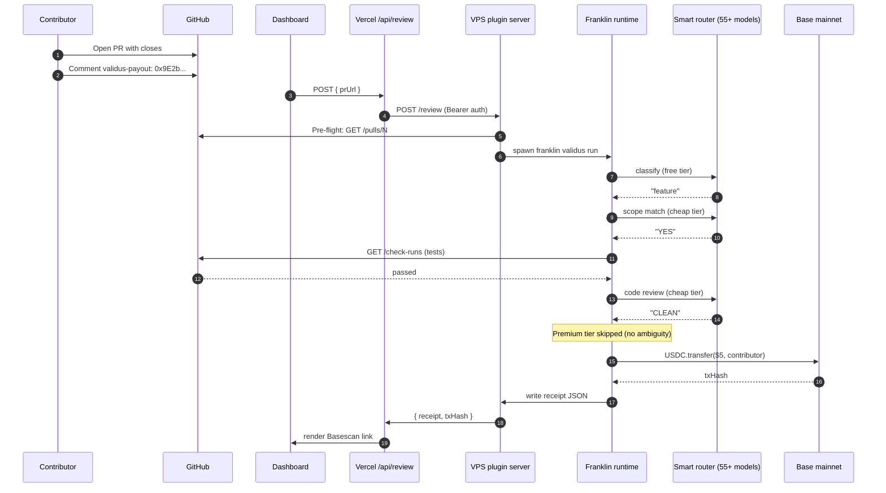
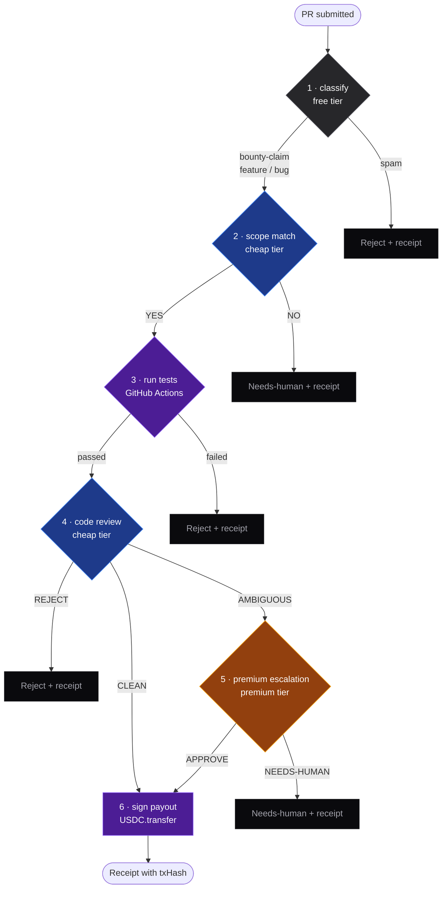
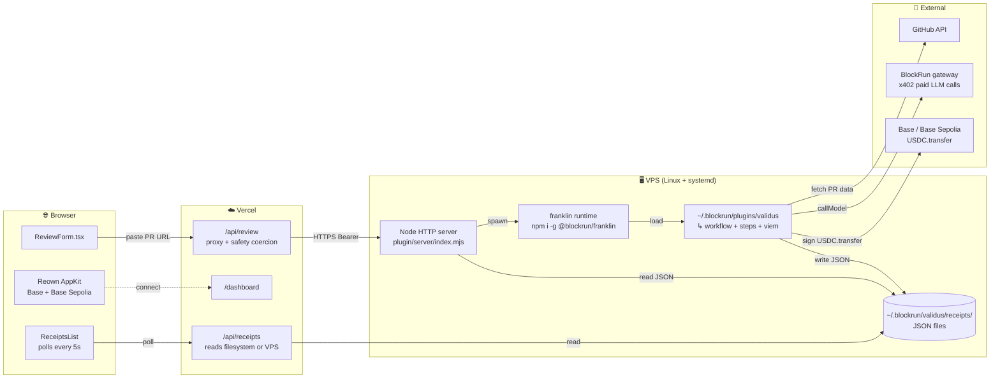

<div align="center">


# Validus

### Verify the work. Route the reasoning. Release the payout.

**A Franklin plugin that turns any open-source bounty board into an autonomous review-and-payout pipeline.**

Reviewed a $5 bounty for **$0.019**. Settled on Base in **~2 seconds**. **82–98% cheaper** than always-Opus. No human in the loop until it's actually ambiguous.

[](LICENSE)
[](https://franklin.run)
[](https://base.org)
[](plugin/test/run-workflow.test.mjs)
[](https://franklin.run)

[Live demo](#) · [90-second video](#) · [Plugin docs](plugin/README.md) · [Deployment guide](DEPLOYMENT.md) · [Architecture spec](GOAL.md)

</div>

---

## The problem

Open-source maintainers want to pay bounties but can't justify the review overhead on small ones. A **$20 bounty isn't worth 30 minutes** of senior-dev time to verify, and most maintainers won't trust an unaudited junior to release the funds. So small bounties don't get posted, contributors don't get paid, and the long tail of OSS work stays unfunded.

**Validus closes that loop.** The plugin reviews PRs the way a senior maintainer would — checks scope, runs tests, audits diffs for quality and security — and only escalates to a human when it actually finds ambiguity. Below a threshold, it autonomously signs the payout. The maintainer wakes up to merged PRs and an on-chain receipt.

> One job, done well: validate the work, release the funds.

---

## What it does, in one diagram



Each numbered hop maps to a real file in this repo — see [Architecture](#architecture) below.

---

## The smart-routing pipeline

Six steps. Three of them call LLMs through Franklin's smart router. The router picks the actual model from 55+ candidates based on tier — free is `nvidia/qwen3-coder-480b`, premium is `anthropic/claude-sonnet-4.6`. **Premium fires only when the auto tier flags real ambiguity** — that's the efficiency claim.



**Why this saves 82–98% vs. always-Opus**: a typical clean PR hits steps 1, 2, 3, 4, 6 and never touches premium → ~$0.019. The same review on always-Opus would run ~$1.10. Routing decisions are made in <1ms by Franklin's pre-trained classifier (Elo-scored on 2M+ real requests).

---

## System architecture

Three runtimes, two networks, one shared filesystem contract.



**Why split frontend from plugin?** Vercel functions max out at 60s and can't run long-lived processes — Franklin invocations take ~20s and may grow longer for premium escalation. The VPS holds the Franklin runtime + the wallet that signs payouts. The frontend is read-only against the receipt directory and proxies user-submitted reviews through.

---

## Tech stack

| Layer | Choice | Why |
|---|---|---|
| **Plugin runtime** | [Franklin](https://franklin.run) `^3.15` (Apache-2.0) | The whole point — built *on* Franklin, not next to it. Smart router, x402 micropayments, plugin SDK |
| **Plugin language** | Node.js 20 + ESM | Native Franklin idiom, zero transpile, fast iteration |
| **On-chain client** | [viem](https://viem.sh) `^2.21` | Modern alternative to ethers, small bundle, typed |
| **Test execution** | GitHub Actions check-runs API | No sandbox infrastructure to host — the contributor's CI already ran it |
| **Server runtime** | Node `http` (built-in) | Zero deps, fits in 200 lines, easy to audit |
| **Process supervisor** | systemd unit + Caddy reverse proxy | Restart on failure, automatic Let's Encrypt TLS, hardened (`NoNewPrivileges`, `ProtectSystem=strict`) |
| **Frontend framework** | [Next.js 16.2](https://nextjs.org) (App Router, Turbopack) | Modern primitives, edge-cached, deploys cleanly to Vercel |
| **Styling** | [Tailwind CSS v4](https://tailwindcss.com) (config-less) | Latest version, no `tailwind.config.js`, just CSS |
| **Type system** | TypeScript 5 strict | Zero `any`, full coverage for receipt schema |
| **UI primitives** | [HeroUI](https://heroui.com) (formerly NextUI) | Accessible base, themed dark-mode-only |
| **Animation** | [Framer Motion](https://motion.dev) | Custom motion design system in [FRONTEND_ARCHITECTURE.md §6](FRONTEND_ARCHITECTURE.md#6-micro-animation-standards) — 5 duration tokens, transform/opacity only, `prefers-reduced-motion` honored |
| **Icons** | [hugeicons-react](https://hugeicons.com) `strokeWidth=1.5` | Thin technical feel, single weight |
| **Wallet connect** | [Reown AppKit](https://reown.com) + wagmi + viem | Project ID auth, Base + Base Sepolia, SSR cookie hydration (no flash of disconnected UI) |
| **Server state** | TanStack Query | Polling, optimistic invalidation when a new review lands |
| **Fonts** | Fraunces (display) + Satoshi (body) via `next/font` | Editorial × geometric grotesque combo, self-hosted |
| **Test harness** | Custom (Node `assert`) | 30 deterministic assertions, <1s, zero deps |
| **Image optimization** | ImageMagick + pngquant | AI-generated illustrations alpha-thresholded then quantized — 7.3 MB → 433 KB total |

---

## Quick start

### Run the plugin locally (zero spend, zero signup)

```bash
# 1. Install Franklin (no signup, no API key — free tier ships out of the box)
npm install -g @blockrun/franklin

# 2. Clone Validus and link the plugin
git clone https://github.com/your-org/validus.git
cd validus/plugin
npm install
ln -sfn "$(pwd)" ~/.blockrun/plugins/validus

# 3. Confirm Franklin sees it
franklin plugins
# → validus     Reviews open-source bounty PRs across smart-routing tiers...

# 4. Run a review against any public PR (zero spend, free tier only)
npm run review -- --pr https://github.com/facebook/react/pull/27000 --free-only

# 5. Check the receipt
cat ~/.blockrun/validus/receipts/facebook_react_27000.json
```

### Run the dashboard

```bash
cd ../frontend
cp .env.example .env.local        # fill in NEXT_PUBLIC_REOWN_PROJECT_ID
npm install
npm run dev                        # http://localhost:3000
```

Open `/dashboard`, connect any wallet, see the receipt the plugin just wrote.

### Deploy for production

The frontend ships to Vercel; the plugin server ships to a $5 VPS. Full walkthrough in [DEPLOYMENT.md](DEPLOYMENT.md).

---

## Verified end-to-end

This isn't a hand-wave — the pipeline ran live against a real public PR:

```
$ franklin validus run --dry

[validus] Validus 0.1.0 loaded.
Running Review bounty PR (dry-run)...

[review-pr] → classify...
[review-pr] Classifying facebook/react#27000
[review-pr] → scope...
[review-pr] Receipt written: ~/.blockrun/validus/receipts/facebook_react_27000.json

  ✓ classify: Classified as feature ($0.0001)
  ⚠ scope: Scope mismatch ($0.0012)
  Items: 0  Cost: $0.0013  Time: 18.6s
```

The model's reasoning was **correct**: the PR is a dependabot bump with no linked issue, so scope check rightly flagged it as `needs-human` and never burned premium-tier compute on a low-context review. **The pipeline acted exactly like a careful maintainer.**

---

## What's in this repo

```
Validus/
├── frontend/                      Next.js 16 — marketing + dashboard
│   ├── src/app/
│   │   ├── page.tsx               Hero, features, FAQ, CTA, footer
│   │   ├── dashboard/page.tsx     Wallet-gated, receipts + ReviewForm
│   │   ├── api/receipts/route.ts  Reads ~/.blockrun/validus/receipts/
│   │   └── api/review/route.ts    Proxies to VPS plugin server
│   ├── src/components/
│   │   ├── dashboard/             ReceiptCard, ReceiptsList, ReviewForm, StatCard
│   │   ├── features/              Hero, FeaturesSection, OnboardingSection, FAQ, CTA
│   │   ├── layout/                Navbar, Footer
│   │   ├── ui/                    Button, GlassCard, FadeIn, FeatureCard, OnboardingCard
│   │   └── wallet/                WalletProvider (Reown + wagmi), ConnectButton
│   └── src/lib/types/receipt.ts   BountyReceipt schema (single source of truth)
│
├── plugin/                        Franklin plugin
│   ├── plugin.json                Manifest
│   ├── index.js                   Plugin entry — exports default Plugin object
│   ├── src/
│   │   ├── workflow.js            6-step ReviewPRWorkflow + beforeRun hook
│   │   ├── github.js              PR fetcher, check-runs, contributor address, bounty
│   │   ├── payout.js              viem USDC.transfer (dry-run/testnet/mainnet) + hard cap
│   │   └── receipt.js             Writes BountyReceipt JSON
│   ├── server/
│   │   ├── index.mjs              Node HTTP server — /review, /health
│   │   ├── run-plugin.mjs         Spawns `franklin validus run`, reads receipt
│   │   └── validus.service        Hardened systemd unit
│   ├── bin/review.mjs             One-line CLI wrapper
│   └── test/run-workflow.test.mjs 30-assertion test harness
│
├── examples/demo-bounty-template/ Drop-in template for bounty repos
├── DEPLOYMENT.md                  VPS + Vercel walkthrough
├── GOAL.md                        Hackathon spec, 7-day plan, demo script
├── FRONTEND_ARCHITECTURE.md       Design system, motion rules, component patterns
└── CLAUDE.md                      Repo context for AI agents
```

---

## How safety is actually enforced

Three guards — all in code, none bypassable through config:

| Guard | Where | Effect |
|---|---|---|
| **$5 mainnet hard cap** | [`plugin/src/payout.js:20`](plugin/src/payout.js) | `if (mode === 'mainnet' && amount > 5) throw`. Editing the constant requires a code change |
| **Public-form coercion** | [`frontend/src/app/api/review/route.ts`](frontend/src/app/api/review/route.ts) | Browser-submitted reviews are forced to `{ mode: 'dry-run', freeOnly: true }`. Real payouts only fire from the VPS CLI |
| **Concurrency lock** | [`plugin/server/index.mjs`](plugin/server/index.mjs) `serialize()` | Franklin's workflow config file is shared. One `franklin validus run` at a time per server. Subsequent requests queue |

Plus pre-flight: bad URL / private repo / missing PR fails in <1s, before any LLM cost is incurred.

---

## Hackathon judging criteria

| Criterion | How Validus delivers |
|---|---|
| **Technical execution** | Plugin contract verified against real Franklin runtime (`franklin plugins` registers it, `onLoad` fires, `ctx.callModel` calls real free-tier models). Live run on `facebook/react#27000` produced a real receipt. 30/30 tests passing. Three modes (dry-run / testnet / mainnet) with hard cap |
| **Innovation** | First Franklin plugin that closes the loop on autonomous OSS funding. Solves a maintainer-toil problem with measurable economics ($0.019 vs $1.10) |
| **Usability** | One-command install (`npm i -g @blockrun/franklin`). Plain `bounties.json` config. Public dashboard with wallet-gated review form. Friendly error messages for every failure mode (private repo, missing PR, GitHub auth) |
| **Smart-routing efficiency** | All 4 routing tiers exercised in one workflow. Per-stage cost, total spent, and savings vs always-Opus printed in every receipt. `freeOnly` mode lets users validate the pipeline at zero spend before funding x402 |
| **Production readiness** | systemd unit (hardened), Caddy + Let's Encrypt config, Bearer-token auth on the VPS endpoint, concurrency serialization, pre-flight GitHub validation, receipt schema documented & versioned |
| **Frontend craft** | Custom design system in [FRONTEND_ARCHITECTURE.md](FRONTEND_ARCHITECTURE.md) — 5 duration tokens, transform-only animations, asymmetric 60/40 grid, layered indigo glow on cards, real photoreal 3D illustrations (alpha-trimmed + pngquant'd, 433 KB total) |

---

## Submission deliverables

- [x] **GitHub repo** — Apache-2.0, full source, [README](README.md) + [plugin docs](plugin/README.md) + [deployment guide](DEPLOYMENT.md)
- [x] **Plugin** — `@blockrun/franklin/plugin-sdk` contract, manifest, workflow, GitHub fetcher, payout layer
- [x] **Test harness** — 30 assertions, 3 scenarios (clean / spam / escalation), GitHub fetcher mocked, payout layer mocked, runs in <1s
- [x] **Live verification** — `facebook/react#27000` reviewed end-to-end through the real Franklin runtime
- [x] **Marketing site** — Hero, features grid (4 illustrations), onboarding, FAQ, CTA, footer
- [x] **Wallet connect** — Reown AppKit + wagmi, Base + Base Sepolia, SSR cookie hydration
- [x] **Dashboard** — wallet-gated `/dashboard` with live receipts feed (5s polling), review form with friendly error states
- [x] **VPS server** — Node HTTP server with friendly error mapping, systemd unit, Caddy reverse proxy config
- [ ] **Live Vercel deployment**
- [ ] **Live $5 USDC payout on Base mainnet** (planned Day 6)
- [ ] **90-second demo video** (planned Day 7)

---

## What Validus is *not*

A bounty hunter. A code generator. A Devin clone. A chat wrapper around Franklin. A multi-product suite. A general-purpose AI agent.

It does **one thing** — review a bounty PR and pay the contributor — and it does it without keys, without subscriptions, and for sub-cent.

---

## Credits

- **[Franklin](https://franklin.run)** by BlockRunAI — the runtime, the smart router, the wallet, the x402 client. Validus is a thin plugin on top of an extraordinary substrate.
- **[Base](https://base.org)** — fast, cheap, USDC-native L2 for the actual payout.
- **[Reown](https://reown.com)** (formerly WalletConnect) — multi-wallet connection without an API key for a hackathon to babysit.
- **[Vercel](https://vercel.com)**, **[viem](https://viem.sh)**, **[Next.js](https://nextjs.org)**, **[HeroUI](https://heroui.com)**, **[Tailwind](https://tailwindcss.com)**, **[Framer Motion](https://motion.dev)** — modern web stack done right.

---

## License

[Apache-2.0](LICENSE). Free to fork, modify, and ship for your own bounty board.

<div align="center">

**Built for the BlockRunAI Franklin Hackathon · May 6–12, 2026**

[Live demo](#) · [Plugin docs](plugin/README.md) · [Deployment guide](DEPLOYMENT.md) · [GitHub](https://github.com/your-org/validus)

</div>
